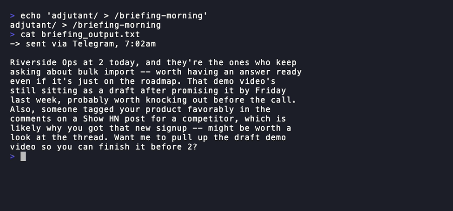

# adjutant

*A working AI chief of staff, running for a year on real work — open-sourced.
Not a framework. Fork it, configure it, make it yours.*

> **Status: pre-launch.** This is the extracted, sanitized v1 of a personal
> automation stack. It hasn't been through its own private beta yet — see
> `docs/ARCHITECTURE.md` for what's shipped vs. roadmapped.


*The board arguing about a fictional decision (a fabricated "Jordan" scenario,
not anyone's real deliberation — see the demo-asset rule in
`docs/ARCHITECTURE.md`). The text is genuine output from the actual
`os/agents/board-*.md` prompts in this repo, not scripted copy.*



*Same rule applies: fictional "Jordan" scenario, genuine output from the
actual `os/skills/briefing-morning/SKILL.md` protocol — a real briefing is
one short message, not a dashboard.*

## What this is

Sixteen-plus scheduled agents, an adversarial three-seat board that argues
about your open decisions and remembers what it told you last time, a
Decision Ledger that refuses to let you re-analyze the same choice forever,
and the barbell pipeline (cheap scout → your best model plans → cheap build →
fresh-context review) that makes all of it maintainable instead of a pile of
one-off prompts. All of it runs on stock Claude Code — no new runtime, no
service to sign up for. You clone this, run one wizard, and you have a
working system by the end of a coffee.

## Why fork instead of install

This isn't a library you `npm install` and forget. It's closer to dotfiles:
you're meant to read it, cut what you don't want, and bend the rest until it
fits your life. The `/setup` wizard gets you a working baseline in minutes;
everything after that is yours to shape.

## Quickstart

```bash
git clone <this-repo> adjutant && cd adjutant
./install.sh
```

Then open Claude Code in this directory and run:

```
/setup
```

That's the onboarding wizard — it interviews you (name, timezone, where your
notes live, what decisions you're sitting on, how you want to be notified)
and writes `config/os.config.yaml`. Nothing else in this repo reads personal
data from anywhere else; that one file is the entire seam between "generic
template" and "your setup."

Try `/today` or `/decide list` right after setup — you should see real output
within a couple of minutes, not a wall of configuration left to do.

## What's in the box (v1)

| Piece | What it does |
|---|---|
| `/board convene` | Three standing critics — a domain veteran, a downside-protection voice, an execution-accountability voice — argue about your open decisions and remember what they told you last time. |
| `/decide` | A Decision Ledger that tracks open high-stakes decisions and refuses to produce fresh analysis on a decision you're already stalling on — it forces a review instead. |
| `/briefing`, `/today` | Pull your notes vault into a current-state summary or a prioritized plan for today. |
| `briefing-morning`, `followups`, `meeting-prep`, `email-triage`, `orchestrator`, `weekly-synthesis`, `health-check` | Schedulable agents — see `os/skills/`. `email-triage` classifies and drafts only; it never sends on your behalf. |
| `os/CLAUDE.md` | The barbell pipeline (scout → plan → implement → review) and delivery gates every other piece assumes. |
| `os/agents/delivery-critic.md`, `persona-qa-player.md` | Fresh-context gates: one reviews any deliverable before you see it, the other plays a deployed app as a named persona before you open the URL yourself. |

See `docs/ARCHITECTURE.md` for the full extraction rationale and
`docs/patterns.md` for the reusable engineering patterns behind the pipeline.

## What this needs from you

- **A scheduler.** This repo ships the *what*, not the *when* — see
  `docs/cookbook/scheduling.md` for wiring up Claude Code scheduled tasks,
  cron, or whatever you already run.
- **Honesty about maintenance.** If you fork this and go quiet, that's fine —
  it's yours now. If you're contributing back, see `ROADMAP.md` for where
  help is wanted and `CONTRIBUTING.md` for the ground rules.

## Specializing this for your field

`examples/verticals/` has a worked example of retuning the board and ledger
for a specific domain (currently: venture capital — `vc.md`). More verticals
are welcome via PR; see `CONTRIBUTING.md`. The board's veteran seat is the
one piece most worth customizing — `board.veteran.domain` in your config is
a start, but a truly sharp veteran usually needs a rewritten persona note in
`os/agents/board-veteran.md`, not just a filled-in field.

## License

MIT — see `LICENSE`. (Placeholder choice; swap before public launch if you
want something else, e.g. Apache-2.0 for an explicit patent grant.)
